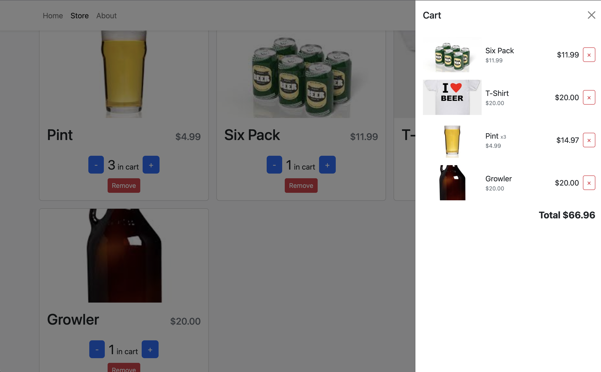

Brewery Store Page

Brewery online store app with shopping cart.

https://brewery-store.netlify.app/

How It's Made: Utlizied components, state, and context to create a shopping application for a small brewery.

Tech used: React, Typescript, Local Storage

Optimizations: Link to payment and database.

Lessons learned: How to use context to broadcast state throughout components.
